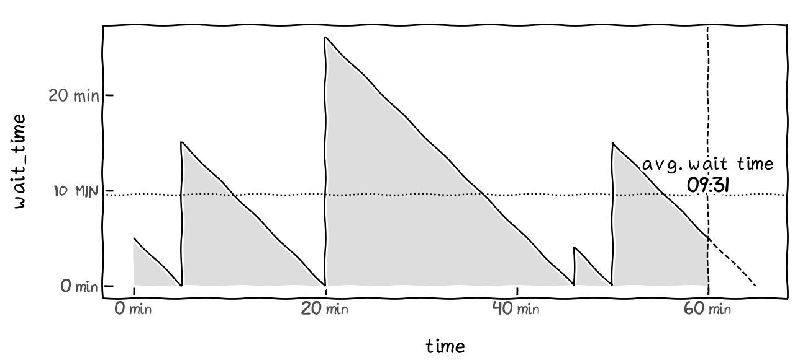
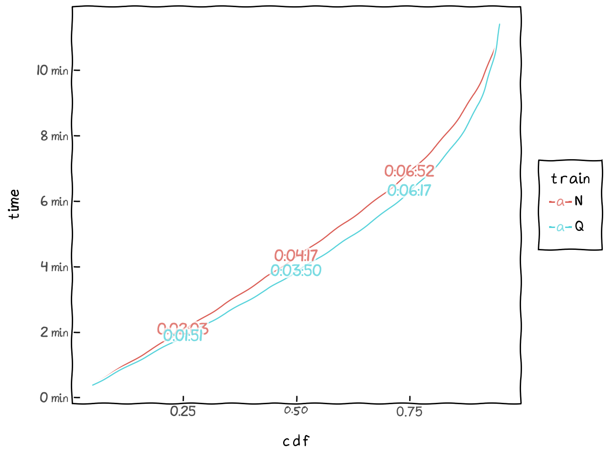

# MTA Subway Effective Frequency

This is a project looking at the average wait time and effective frequency of a train at a station in the MTA Subway system. 

## How Should We Define Frequency?
As a frequent subway rider, I often wondered why my wait time is always longer than what MTA suggested. Often, I waited so long for a very packed train, but then another one would arrive 2 minutes after. 

Uneven train arrivals create inefficiency, which can be easily illustrated with the following scenarios:

Scenario 1: Trains are arriving evenly at 5, 20, 35, 50, and 65 minutes after the hour.

Scenario 2: Train are arriving unevenly at 5, 20, 46, 50, and 65 minutes after the hour.
> "We are investigating a emergency brake engaged unexpectedly at Jay Street," said the train operator.

In both scenarios, the simple definition would tell us they have the same arrival frequency of 4 trains per hours, or 15 minutes per train. But that wouldn't convey the the additional wait time felt by the riders.

So instead of looking at the number of trains per hour, we look at the **average wait time** of riders during that hour, and multiply the average wait time by 2 will give us the **effective frequency**. In Scenario 2, the in-theory-15-minute-per-train schedule becomes 19 minutes per train in practice.

Some math on average wait time calculation

To introduce some formality, the average wait time is

$$\text{AvgWaitTime} = \int_S^T \text{WaitTime}(t) \cdot \text{RiderDensity}(t) dt$$

where $S$ and $T$ are the start and end time of the observing periods, respectively.

Here we are assuming uniform rider density, i.e. $1 / (T - S)$, and the wait time at time $t$ is piecewise linear function of slope -1 (think about the isosceles right triangles above), specifically

$$\text{WaitTime}(t) = \text{NextArrivalTime} - t$$

Then, the average wait time during an hour (i.e. $T-S=1$) can be simplified calculate the total area of the wait-time triangles, and then subtract the small triangles after the 1-hour mark (under the dotted line). Putting it in equation:

$$\text{AvgWaitTime} = \frac{1}{T - S} \cdot \frac{1}{2} \cdot \left[\sum_{n=1}^N (\text{ArrivalTime}(n) - \text{ArrivalTime}(n-1))^2 - (\text{ArrivalTime}(N) - T)^2\right]$$

where $N$ is the number of arrivals during the period + 1 (adding 1 for the arrival immediately after the hour), and $\text{ArrivalTime}(0)$ is set to the start time of the period, $S$.

For example, in scenario 2 where trains arrived at 5, 20, 46, 50, and 65 minutes after the start time, the average wait time will be $\frac{1}{60} \cdot \frac{1}{2} \cdot (5^2 + 15^2 + 26^2 + 4^2 + 15^2 - 5^2) = 9.52 \text{ min}$.

## The Wait Time Distribution Function

In this project, we collected actual MTA subway arrival data from https://subwaydata.nyc. Massive thanks to James Fennell ([GitHub](https://github.com/jamespfennell)) for aggregating and hosting the data over the last couple years!

The project uses the arrival data from 2024-01-01 to early 2025, during which there were over 3 million trips and over 83 million records on each trip's arrival time at each of its stops. With this data, not only can we look at average wait time at any specific hour, we can build an empirical distribution function for wait time at any station at a given hour (e.g. wait time for northbound N train at Kings Hwy at 8AM weekday).

Let's start from simple example like above, where we have 1 evenly arrived train and 1 unevenly arrived train. Their wait time cumulative distribution function will look something like this (note that wait time is on the y-axis to better show the difference)

The uneven train is indeed having a longer tail, i.e., under the worst-case scenario, riders waiting for the uneven trains need to wait way longer (if they just missed a train and the next one has heavy delay).

Now, lets look at some real world example, northbound N and Q trains at Kings Hwy (2 different Kings Hwy stations) at 8AM weekday (with the inter-quartile range labeled):

Or let's also look at the same stations at 8AM during weekend:

## What's Next
- [ ] Explore different ways to look at the data and provide more interest data viz
- [ ] Create an interactive web app for people to explore their home station at their preferred departure times
- [ ] Share the data

## How to Run it Yourself
This project use Python 3.11 (3.8+ should be fine). Special shout-out to the following libraries
- [`duckdb`](https://duckdb.org): probably the best in-process columnar database available right now, enabling fast analytics for this project.
- [`plotnine`](https://plotnine.org): a grammar of graphic port to python, drawing all the data viz in the project

(Almost goes without saying that you will also need to install `pandas` and `numpy`. `venv` or your favorite dependency management tool is recommended.)
